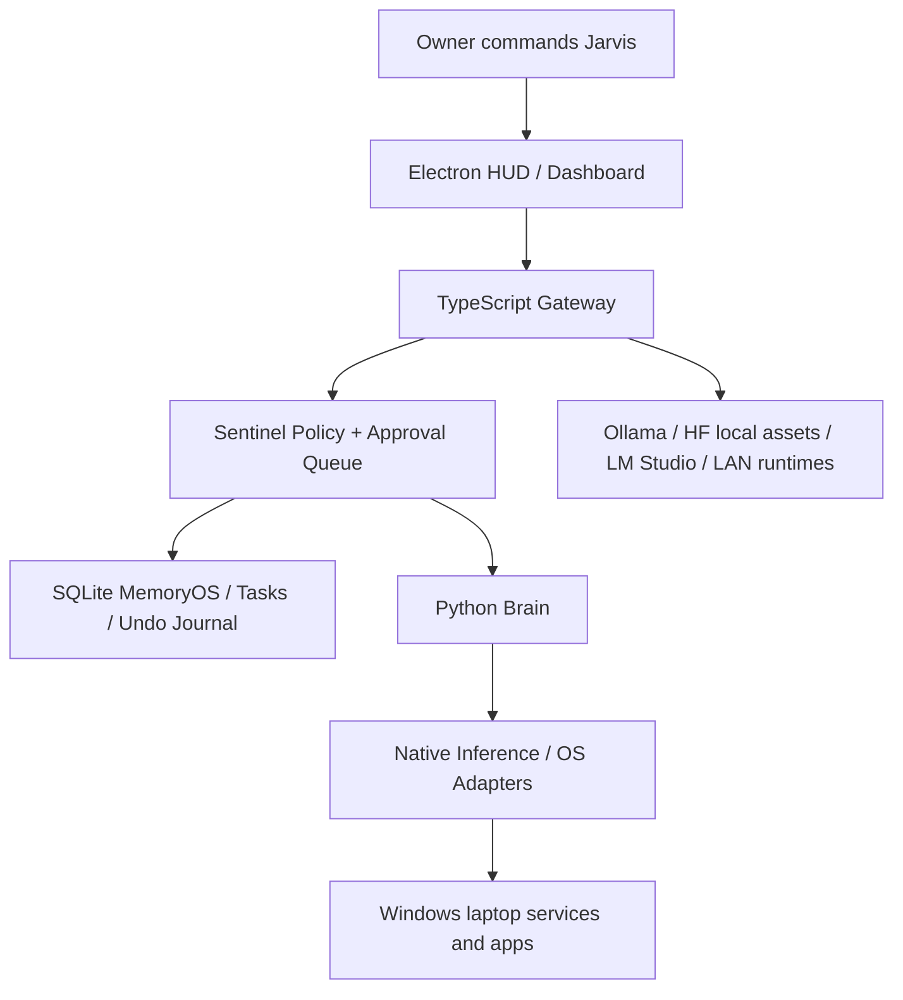

# Architecture Hardening Review

This review captures the current Jarvis runtime hierarchy, language choices, startup path, authority model, and cleanup priorities. It is meant to guide future optimization without turning the UI into a wall of diagnostics.

## Runtime Hierarchy

The hierarchy keeps UI and runtime control separate. The HUD collects commands and shows concise state. The gateway owns contracts, memory, policy, queueing, and approvals. Python handles AI sidecars and approved local automation. Native runtimes handle inference where performance matters.

## Language Strategy

- TypeScript stays the best layer for HUD, dashboard, typed API contracts, SSE streams, model registry views, setup flows, and policy-visible orchestration.
- Python stays the best layer for model probes, STT/TTS/vision sidecars, local AI ecosystem glue, and approved automation bridges.
- Native/C++ runtimes stay the best layer for llama.cpp, whisper.cpp, Piper, and other hot inference paths.
- PowerShell stays the Windows bootstrap layer for startup tasks, hidden background services, runtime verification, and stop/start scripts.
- SQLite remains the reliable local state layer; vector/graph stores can be added behind MemoryOS interfaces later.

Do not move heavy model loading or microphone/GPU pipelines into TypeScript. Do not move HUD animation into Python. Keep each language where it gives the most leverage.

## Startup And Background Operation

The production path is:

- `scripts/start-jarvis.ps1` launches Ollama when present, Python Brain, TypeScript Gateway, HUD renderer, Electron HUD, and optional dashboard.
- `scripts/register-startup-task.ps1` registers a Windows logon task or Startup shortcut fallback.
- `scripts/stop-jarvis.ps1` stops tracked runtime processes using PID files.
- `scripts/verify-jarvis.ps1` checks build/test/runtime health and can run startup check-only mode.

`GET /api/runtime/startup-readiness` is read-only. It reports startup scripts, scheduled task/shortcut configuration, PID files, and whether elevated startup intent exists. It does not register startup, elevate, or execute OS actions.

## Authority Model

Jarvis can become a high-trust local assistant, but it cannot become an uncontrolled background actor.

- Safe local reads and approved app/window operations can be allowed.
- Deletes, writes, scripts, service control, sensors, credentials, external sends, social posts, purchases, model downloads, and device control require approval.
- Approved-admin mode is a readiness state created by the Windows scheduled task. It still does not bypass Sentinel policy.
- Protected core source, safeguards, secrets, and raw model internals are sealed from runtime agents.
- Jarvis-managed reversible file/config changes receive a 20-minute undo checkpoint when feasible.
- Non-reversible actions must be labeled before approval.
- Emergency stop pauses agents, listening/capture, and queues while preserving logs and checkpoints.

`GET /api/security/authority-readiness` exposes this hierarchy to the UI as compact state, not as executable power.

## Code Health Priorities

The codebase is intentionally broad now, so cleanup should be staged rather than impulsive.

1. Split `services/gateway/src/server.ts` into route modules after the current endpoint tests stay green.
2. Extract repeated HUD card/detail styles into shared compact-card classes.
3. Keep reference projects isolated under `vendor/reference`; do not merge external shells directly into Jarvis runtime.
4. Remove stale placeholders only when a real implementation or explicit future slot replaces them.
5. Preserve public API compatibility while moving implementation details into focused modules.
6. Add lazy loading/code splitting for heavy HUD panels after behavior stabilizes.

`GET /api/architecture/code-health` is advisory. It flags oversized files, duplicate basenames, repeated route literals, stale markers, and possible unreferenced source files. It should never be treated as an automatic delete list.

## Current Optimization Backlog

- Route extraction: health/setup/model/runtime/security/system/workflow route modules.
- HUD CSS consolidation: shared hardening/setup/plugin cards and status chips.
- Runtime package path: compiled gateway/HUD start path instead of dev-process startup for everyday use.
- Model runtime activation: prefer lightweight Ollama/GGUF laptop paths and route heavy assets through LM Studio/workstation/homelab endpoints.
- Event efficiency: keep SSE payloads compact and avoid sending raw logs unless a drawer is expanded.
- Memory efficiency: use rolling summaries and RAG recall instead of unbounded prompt history.

## Verification Surface

Architecture hardening is verified by:

- Gateway unit tests for architecture map, code health, startup readiness, and authority readiness.
- HUD UI tests for compact hardening summaries on desktop and mobile.
- Runtime smoke checks for gateway, brain, HUD, and startup scripts.
- Manual review of the Settings panel to ensure diagnostics are glanceable and details stay collapsed.
