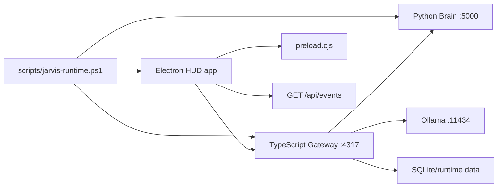

# Architecture Schema Sweep

Updated: 2026-05-18

This is the first pass of the requested deep code-analysis sweep. It records the actual Jarvis code paths as they exist today, then separates future architecture targets from current production code.

## Current Runtime Topology

There is no production Rust core in this repo today. The Rust sidecar remains a future migration target. Current trusted orchestration is TypeScript Gateway plus Python Brain.

## Electron Main Process

Files:

- `apps/hud/electron/main.ts`
- `apps/hud/electron/preload.cjs`

Responsibilities:

- Create the HUD window.
- Enforce single-instance behavior.
- Own tray menu and app lifecycle commands.
- Call Gateway runtime endpoints for stop, restart, live test, emergency stop, and dashboard opening.
- Expose a narrow context-isolated bridge through `window.jarvisDesktop`.

IPC channels currently exposed:

- `jarvis:tray-command`
- `app:show`
- `app:hide`
- `app:focus-existing`
- `app:quit`

Renderer receives:

- `jarvis:tray-action`

Security note: renderer does not directly call `fs` or shell. Native lifecycle actions are mediated by Electron main and Gateway/runtime scripts.

## HUD Renderer

Files:

- `apps/hud/src/HudApp.tsx`
- `apps/hud/src/components/HudPanel.tsx`
- `apps/hud/src/components/Orb.tsx`
- `apps/hud/src/components/RadialMenu.tsx`
- `apps/hud/src/components/WorkflowConsole.tsx`
- `apps/hud/src/hooks/useJarvisStatus.ts`
- `apps/hud/src/state/hudState.tsx`
- `apps/hud/src/styles.css`

State stores:

- React local state for panel selection, sidebar expansion, visual HUD state, busy runtime controls, and command submission state.
- `HudStateProvider` for orb/HUD state.
- `useJarvisStatus` polls lightweight `/api/status`.
- `EventSource /api/events` pushes live task/runtime events to the HUD.

Heavy panel fetches:

- `HudPanel.tsx` still fetches many readiness/runtime endpoints when the panel component mounts. Next optimization should gate these by active panel and refresh intent instead of loading every subsystem whenever any panel opens.

## Gateway

Files:

- `services/gateway/src/server.ts`
- `services/gateway/src/store.ts`
- `services/gateway/src/eventHub.ts`
- `services/gateway/src/runtime*.ts`
- `services/gateway/src/liveVoice.ts`
- `services/gateway/src/voiceReadiness.ts`
- `services/gateway/src/visionReadiness.ts`
- `services/gateway/src/model*.ts`
- `services/gateway/src/architectureMap.ts`
- `services/gateway/src/codeHealth.ts`

Responsibilities:

- HTTP API for status, chat, approvals, tasks, models, runtime control, readiness, workflows, voice, vision, setup, and mobile pairing.
- SQLite persistence for conversations, memory, timeline, tasks, workflows, approvals, runtime events, and undo journal.
- Event hub for server-sent events.
- Policy enforcement and approval-gated action records.
- Runtime control previews and live tests.

Known refactor pressure:

- `server.ts` is large and still owns many route groups directly.
- Route extraction already began in `services/gateway/src/routes`.
- Future passes should extract voice, workflow, approvals, model runtime, and system action route groups behind narrow tests.

## Python Brain

Files:

- `services/brain/brain_server.py`
- `services/brain/voice.py`
- `services/brain/vision.py`
- `services/brain/system_control.py`
- `services/brain/identity.py`

Responsibilities:

- Brain health and command execution stubs.
- Local voice readiness and future STT/TTS execution paths.
- Vision readiness and analysis stubs.
- Guarded system-control execution entrypoint.

Current readiness:

- Local Python 3.11 venv is ready.
- Transformers/Torch voice packages are installed.
- Whisper STT, VAD, Porcupine package, Kokoro folder, and OmniVoice folder are detected.
- Piper executable, Vosk model folder, and wake-word profile folder remain missing optional feature assets.

## Runtime Scripts

Files:

- `scripts/jarvis-runtime.ps1`
- `scripts/setup-voice-runtime.ps1`
- `scripts/start-jarvis.ps1`
- `scripts/stop-jarvis.ps1`
- wrapper `.cmd` files at repo root

Responsibilities:

- Start/stop/restart/status/live-test/register-startup through one supervisor.
- Keep logs and PID files under `data/runtime` and `data/logs`.
- Prefer project-local Brain venv.
- Provide bounded voice dependency setup with no token echoing.

## Primary Data Flows

### User Text

`HUD text panel -> POST /api/chat -> Gateway store/task queue -> Ollama or local fallback -> conversation + task events -> /api/events -> HUD capsule/panel`.

### Voice Command

`HUD voice panel -> /api/voice/listening/start -> transcript draft -> /api/voice/transcript/commit -> /api/chat -> event stream -> HUD`.

Future automatic path:

`wake dependency + approval -> local mic/VAD -> Whisper STT -> chat/task queue -> TTS -> orb speaking state`.

### Runtime Control

`HUD button -> Electron IPC or Gateway endpoint -> scripts/jarvis-runtime.ps1 dry-run/control -> runtime event + status refresh`.

### Workflow

`WorkflowConsole -> /api/workflows/studio -> local draft layout/edit/run endpoints -> Sentinel/policy approvals -> execution/activity events`.

## First Findings

- Sidebar/panel layout is a UI-contract issue, not a backend issue. The stage center must be derived from usable content bounds.
- Voice UI carried too much readiness detail as primary content. It should expose one compact control surface and hide runtime details behind a drawer.
- Renderer shell/native access appears mediated through preload and Gateway; no direct renderer shell access was found in the first grep pass.
- The largest duplication/refactor target is Gateway route sprawl in `server.ts`.
- The next performance target is lazy panel fetches, especially Settings and Voice readiness bundles.

## Next Sweep Passes

1. Generate route inventory from `server.ts` and map endpoints to owning modules/tests.
2. Identify unused renderer CSS/components after the compact voice/sidebar changes settle.
3. Convert heavy readiness fetches to panel-scoped lazy queries with cached event updates.
4. Add an IPC/security boundary test that fails if renderer code imports shell/fs/process APIs directly.
