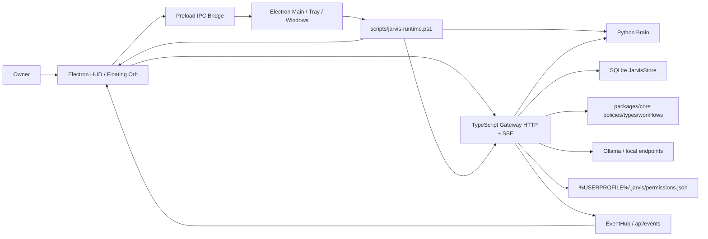

# Jarvis Codebase Relational Schema And Audit

Generated during Phase 53. This is a living map of the real repo, not an idealized architecture.

## Repository Entities

| Entity | Path | Role |
| --- | --- | --- |
| HUD app | `apps/hud` | Primary Electron + React desktop app, floating orb, tray app, panels, workflow console, Playwright UI tests |
| Dashboard fallback | `apps/dashboard` | Vite fallback/control room surface |
| Desktop fallback | `apps/desktop` | Electron/Tauri-era wrapper retained for compatibility |
| Core package | `packages/core` | Shared types, model registry, setup catalog, policies, agents, memory, task queue, workflows, system actions |
| Gateway | `services/gateway` | Node HTTP/SSE service, persistence, runtime endpoints, approvals, workflows, memory, model/voice/readiness routing |
| Brain | `services/brain` | Python sidecar for local model/voice/vision/system-control probes and actions |
| Muscle | `services/muscle` | Native/Rust placeholder for lower-level future runtime work |
| Runtime scripts | `scripts` | Canonical supervisor, setup, voice setup, organizer, smoke/verify helpers |
| Souls | `souls/*` | File-backed personalities and operating scopes for Jarvis, Friday, Daedalus, Argus, Mnemosyne, Sentinel, Vulcan, Hermes |
| Vendor references | `vendor/reference` | OpenClaw, Ruflo, and Jarvis variants retained as audited references, not product shells |
| Local data | `data`, `%USERPROFILE%\.jarvis` | Runtime logs, smoke outputs, SQLite store, permission memory, checkpoints |

## Runtime Relationship Graph

## Primary Data Flows

### App Startup
1. User launches a wrapper or the startup task.
2. Wrapper calls `scripts/jarvis-runtime.ps1`.
3. Supervisor cleans stale PID files/processes, keeps Ollama running, starts Brain, Gateway, and Electron HUD.
4. Electron enforces single-instance behavior and restores/focuses an existing window on duplicate launch.
5. HUD reads lightweight status, opens SSE, and displays the orb immediately.

### Text Command
1. HUD text form posts to `POST /api/chat`.
2. Gateway creates/updates conversation records and a task queue item in `JarvisStore`.
3. Gateway returns quickly while `runAssistantTask` continues in the background.
4. Model router prefers fast local endpoints/Ollama, with fallback local simulation/protected-core response as needed.
5. Gateway writes turns, task events, memory/timeline records, and emits SSE task events.
6. HUD receives events and updates capsule/panel state.

### Approval
1. HUD receives pending approval from status/event state.
2. Approve/deny calls generic `/api/approvals/:id/approve|deny`, except confirmed system actions may use `/api/system/actions/:id/approve`.
3. Gateway `completeApproval` applies side effects, writes memory/timeline, and stores capability-scoped permission memory.
4. Remembered exact grants skip repeat prompts unless the category is sensitive.
5. HUD clears the chip and shows compact success/failure state.

### Voice
1. HUD voice buttons call Gateway voice endpoints for listening, transcript, TTS, stop, readiness, and session state.
2. Gateway probes local Python packages and voice/model folders.
3. Brain `voice.py` handles STT/TTS readiness and basic synthesis/probe calls.
4. SAPI/sample playback is immediate fallback; Kokoro/Piper/OmniVoice are readiness-routed feature dependencies.
5. Wake-word remains approval-gated before continuous mic capture.

### Workflow
1. HUD `WorkflowConsole` loads `/api/workflows/studio`.
2. Canvas edits persist through `/api/workflows/:id/layout` and `/api/workflows/:id/draft-edit`.
3. Generated workflows call `/api/workflows/generate` and are disabled until owner approval.
4. Execution calls workflow run endpoints; Gateway executes step-by-step with Sentinel/policy checks and approval-gated steps.
5. Activity events are persisted and surfaced in HUD.

### Model And Readiness
1. Core catalogs seed ready assets, feature downloads, and future scaling models.
2. Gateway scans local paths for existence, config/tokenizer files, weight files, pointer-sized shards, and partial downloads.
3. UI labels distinguish `Downloaded`, `Runnable`, `Staged`, `Incomplete`, and `Future scaling`.
4. Heavy probes are explicit, not automatic.

## IPC Channels

| Channel | Direction | Purpose |
| --- | --- | --- |
| `jarvis:tray-action` | Main to renderer | Push tray/menu actions into HUD state |
| `jarvis:tray-command` | Renderer to main | Run app actions such as dashboard, voice, live test, stop, restart |
| `app:show` | Renderer to main | Restore/show main HUD window |
| `app:hide` | Renderer to main | Hide main HUD window |
| `app:focus-existing` | Renderer to main | Focus existing single instance |
| `app:quit` | Renderer to main | Explicit app quit path |
| `orb:show` | Renderer to main | Show floating orb |
| `orb:hide` | Renderer to main | Hide floating orb |
| `orb:set-interactive` | Renderer to main | Toggle click-through/interactivity for floating orb window |

## State Stores

| Store | Owner | Persistence | Notes |
| --- | --- | --- | --- |
| React component state | HUD renderer | In-memory | Fast view state, panel selections, busy controls |
| HUD status hook | HUD renderer | In-memory, polled | `/api/status` every 4s plus SSE for task events |
| HUD panel cache | HUD renderer | `localStorage` | Phase 53 stale-while-revalidate cache for heavy panel payloads |
| `JarvisStore` | Gateway | SQLite | Conversations, turns, tasks, queue, memory, timeline, undo, workflows, workflow runs |
| Permission memory | Gateway | `%USERPROFILE%\.jarvis\permissions.json` | Capability-scoped remembered decisions |
| Runtime files | Supervisor/Gateway | `data/runtime`, `data/logs`, `data/smoke` | PID files, logs, live-test outputs |
| Workflow layouts | Gateway | JSON/data path | Canvas positions and editable layout metadata |

## Function And Loop Audit

### Loops That Are Intended
- `useJarvisStatus` polls `/api/status` every 4 seconds as a lightweight fallback.
- HUD opens `EventSource /api/events` for push task events.
- Runtime scripts wait on HTTP readiness with bounded deadlines.
- Workflow execution loops through DAG steps and records events.
- Store embedding helper loops through tokens to create a deterministic local vector placeholder.

### Loops Or Fetch Patterns To Optimize
- `HudPanel.tsx` opens many independent fetches whenever Settings is opened. Phase 53 adds persistent cached display while refresh happens.
- Voice/Dashboard panel fetches are smaller but still benefit from stale-while-revalidate.
- `services/gateway/src/server.ts` is a large route concentrator and should continue being extracted into route modules.
- Model/voice readiness should remain panel-driven rather than global startup-driven.

## Security Boundaries

1. Renderer must not directly access filesystem, shell, secrets, or model internals.
2. Electron preload exposes a narrow IPC bridge only.
3. Gateway owns policy, approval, memory, connector routing, runtime status, and persistence.
4. Python Brain performs local probes/actions through Gateway-approved calls.
5. Runtime agents cannot inspect protected core code, secrets, safeguards, or raw model tensors.
6. Social/device/system actions are dry-run/approval-first.
7. Reversible file/config actions should create undo entries before execution.

## Multi-Pass Verification Notes

### Pass 1 - Structure Versus Plan
- Actual repo now matches the main target shape: `apps/hud`, `packages/core`, `services/gateway`, `services/brain`, `scripts`, `souls`, `vendor/reference`.
- The old plan note claiming `apps/hud` did not exist was stale and corrected in Phase 53.
- Rust core remains conceptual/future; current production runtime is TypeScript Gateway plus Python Brain.

### Pass 2 - Data Flow Versus Code
- Electron IPC channels in `apps/hud/electron/main.ts` match preload exposure in `apps/hud/electron/preload.cjs`.
- HUD uses both polling and SSE; polling is still acceptable for status but should not carry heavy data.
- Gateway has an EventHub and a compact stream status path, but only task events are fully consumed by HUD today.

### Pass 3 - Dead/Duplicate Risk
- Runtime launch compatibility wrappers are retained, but they point to the canonical supervisor direction.
- `apps/dashboard` and `apps/desktop` are fallback/compatibility surfaces; they should not receive new primary UX work unless explicitly needed.
- `services/gateway/src/server.ts` still centralizes too many concerns and is the main future refactor target.

### Pass 4 - Performance And Persistence
- Current slow feeling is mostly panel cold-load and many independent fetches, not the centered orb itself.
- Phase 53 cache strategy keeps last-known panel data present through app reloads and service restarts.
- Long-term improvement: push readiness deltas over SSE and add server-side cached readiness snapshots with TTL.

## Optimization Backlog

1. Extract Settings route handlers from `server.ts` into route modules.
2. Add server-side TTL cache for expensive doctor/readiness scans.
3. Convert HUD panel fetch clusters into a reusable cached resource hook.
4. Push approval/status/readiness delta events to reduce polling.
5. Add cache invalidation when approvals, startup registration, voice setup, or model scans complete.
6. Move workflow execution/event rendering to a stronger shared store so canvas edits and run state do not reload independently.
